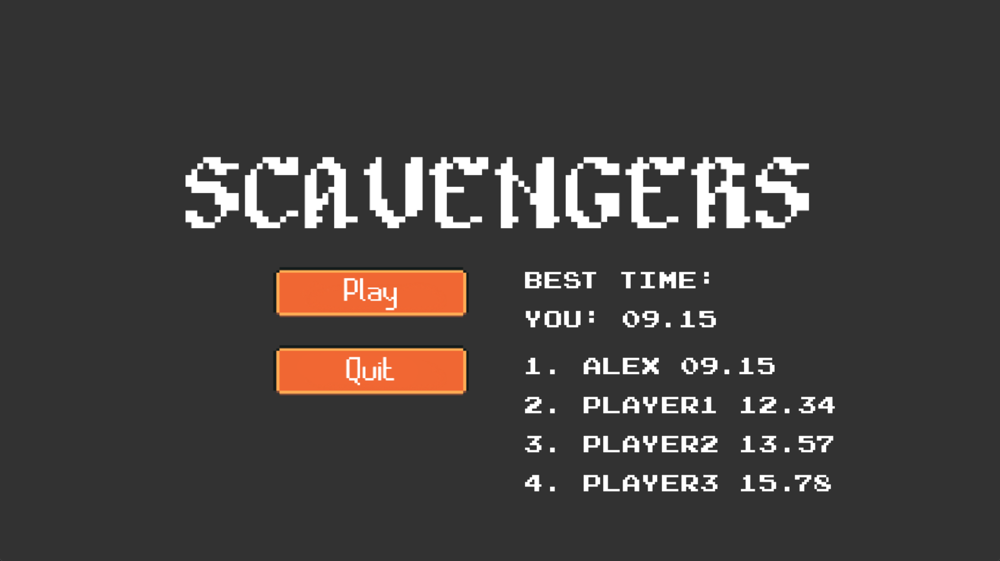
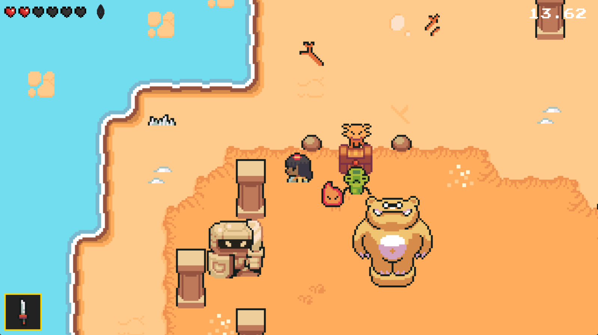

#  Scavengers

**Название можно трактовать по-разному**:  
🔪 *Падальщики* | 💎 *Искатели сокровищ* | ☠️ *Пираты*

**Жанр**: Speedrun-метроидвания с элементами Roguelite  
**Язык**: Python 3.12 + Pygame  

---

## 🎮 О игре

Вы — авантюрист, оказавшийся на опасном острове. Ваша цель:  
1. 🗡️ **Уничтожить всех врагов**  
2. 🏆 **Забрать руну из сундука** (ограбить остров)  
3. 🚩 **Добраться до зоны эвакуации** (отмечена красными флажками)  

⏱️ **Главная механика**: Таймер и глобальный лидерборд с лучшим временем прохождения.  
🌐 **Требуется интернет** для отображения таблицы рекордов других игроков.

---

## 🚀 Как начать?

```bash
# 1. Установите зависимости
pip install -r requirements.txt

# 2. Запустите игру
python main.py
```

После запуска:  
1. 📝 Зарегистрируйтесь (имя сохраняется в БД)  
2. 🎯 Убивайте врагов, ищите руну  
3. ⚡ Оптимизируйте маршрут для топового времени!

---

## 🛠️ Техническая часть

### 📦 Использованные ресурсы
- **Ассеты**: [Ninja Adventure Pack](https://pixel-boy.itch.io/ninja-adventure-asset-pack) (пиксельная графика)  
- **БД**: PostgreSQL на VK Cloud (Ubuntu VM)  

### 🔧 Реализованные системы
| Компонент       | Статус | Описание                          |
|-----------------|--------|-----------------------------------|
| Карта и уровень | ✅      | Tile-based с коллизиями           |
| Игрок           | ✅      | Анимации, оружие, инвентарь       |
| Камера          | ✅      | Слежение с Y-сортировкой          |
| Враги           | ✅      | ИИ, патрулирование, атаки         |
| UI              | ✅      | Здоровье, таймер, меню            |
| Лидерборд       | ✅      | Глобальная таблица рекордов       |
| Частицы         | ✅      | Эффекты атак/смерти               |

---

## 📸 Скриншоты

<div align="center">
  
  
</div>

---

## 📌 Особенности
- **Соревновательность**: Битва за место в топе лидерборда  
- **Атмосфера**: Весёлый пиксельный стиль с динамичным геймплеем  
- **Оптимизация**: Плавный рендеринг даже на слабых ПК  
